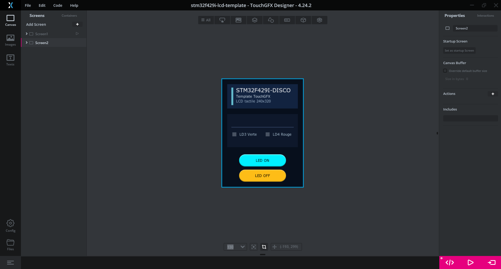

# STM32F429I-DISCO + TouchGFX

Base de projet pour `STM32F429I-DISCO` avec :
- `STM32CubeIDE`
- `TouchGFX`
- `FreeRTOS`
- écran LCD 240x320
- tactile `STMPE811`

Le projet démarre sur un splash screen puis ouvre un écran simple avec deux boutons pour piloter les LED.

## Contenu

- projet `STM32CubeIDE`
- configuration CubeMX dans [stm32f429i-lcd-template.ioc](/c:/Users/Jocelyn/Documents/GitHub/stm32f429i-lcd-template/stm32f429i-lcd-template.ioc)
- projet TouchGFX dans [stm32f429i-lcd-template.touchgfx](/c:/Users/Jocelyn/Documents/GitHub/stm32f429i-lcd-template/TouchGFX/stm32f429i-lcd-template.touchgfx)
- sources `HAL`, `CMSIS`, `FreeRTOS`, `BSP` et `TouchGFX`



## Environnement utilisé pour les tests

Ce dépôt a été vérifié avec :
- `Windows 11`
- `STM32CubeMX 6.12.0`
- `STM32CubeIDE 1.16.1`
- `STM32CubeProgrammer 2.18.0`
- `STM32CubeCLT 1.17.0`
- `TouchGFX 4.24.2`
- `FreeRTOS 10.3.1`

## Carte cible

- carte : `STM32F429I-DISCO`
- MCU : `STM32F429ZITx`
- écran : `240x320`
- tactile : `STMPE811`

## Ouvrir le projet

### Dans STM32CubeIDE

Le plus simple est d'importer le dépôt comme projet STM32 :

1. ouvrir `STM32CubeIDE`
2. importer le dossier du dépôt comme projet existant
3. si besoin, choisir l'import en tant que projet `STM32`

Une fois importé, le projet peut être compilé, lancé en debug et flashé directement depuis `STM32CubeIDE`.

### Dans TouchGFX Designer

Pour ouvrir l'interface dans `TouchGFX Designer`, il suffit d'ouvrir le fichier :

- [stm32f429i-lcd-template.touchgfx](/c:/Users/Jocelyn/Documents/GitHub/stm32f429i-lcd-template/TouchGFX/stm32f429i-lcd-template.touchgfx)

Autrement dit, il faut simplement ouvrir le projet depuis le dossier `TouchGFX` depuis l'explorateur de projet.

## Compilation

### Depuis STM32CubeIDE

Après import du projet, la compilation peut se faire normalement depuis l'IDE.

### Depuis TouchGFX Designer

Depuis `TouchGFX Designer`, la commande cible est déjà configurée.

Depuis un terminal :

```powershell
PowerShell -NoProfile -ExecutionPolicy Bypass -File .\TouchGFX\compile_target.ps1
```

Le script essaie d'abord un build headless via `STM32CubeIDE`. Si `CubeIDE` n'est pas trouvé, il utilise `make` si le projet a déjà été généré.

## Flash

### Depuis STM32CubeIDE

Après import du projet, la carte peut être flashée directement depuis `STM32CubeIDE`.

### Depuis un terminal

```powershell
PowerShell -NoProfile -ExecutionPolicy Bypass -File .\TouchGFX\flash_target.ps1
```

Le flash se fait sur `Debug\stm32f429i-lcd-template.elf` via `ST-LINK/SWD`.

## Simulateur

```powershell
PowerShell -NoProfile -ExecutionPolicy Bypass -File .\TouchGFX\compile_simulator.ps1
```
